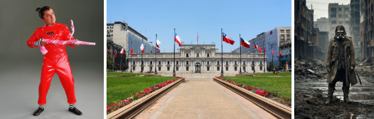
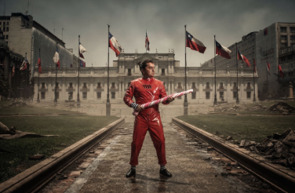
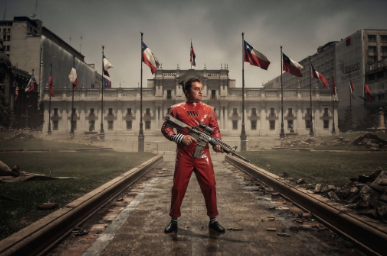
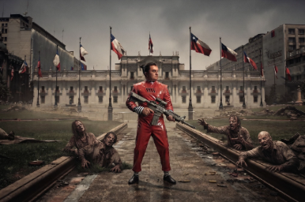
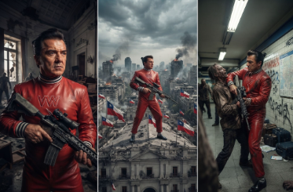
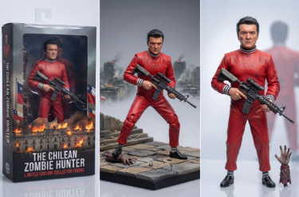
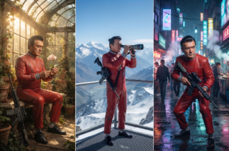

**EJERCICIO 1**

**Prompt:** Director creativo

**Prompt:** Director creativo de 37 años, su vestimenta es estilo hipster, está en una agencia de publicidad, la luz del sol le llega por su ventana en el ocaso, el plano debe ser medio, que tenga una taza de café en su mano, la paleta cromática es cálida, el look debe ser híper realista.

**EJERCICIO 2**

**Prompt:** Director creativo liderando un brainstorming

**Prompt:** Cambia el tiro de captura de la fotografía

**Prompt:** Cambia la iluminación a escena nocturna

**Prompt:** Cambia el estilo a cyberpunk

**Prompt:** Cambia la paleta a tonos rosados

**EJERCICIO 3**

**Prompt:** Combínalas en una composición coherente, teniendo en cuenta la primera imagen como el personaje principal, la segunda como el escenario y la tercera como el estilo fotográfico

**Prompt:** Cambia el bastón de dulce que tiene en sus manos por un fusil

**Prompt:** Agrega zombies saliendo desde el pasto a los costados

**EJERCICIO 4**

**Prompt:** Genera 3 imágenes en distintas situaciones, manteniendo el personaje principal

**Prompt:** Sin basarse en las imágenes de arriba genera 3 imágenes usando al personaje principal como producto, transfórmalo en una figura de acción

**Prompt:** Manteniendo al personaje, genera 3 imágenes en distintas atmósferas/ escenarios y emociones, sin texto

