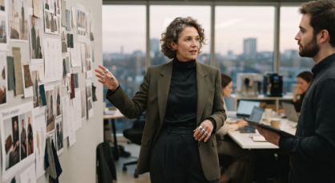
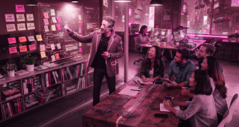

**EJERCICIO 1**

**Prompt:** Director creativo

**Prompt:** Director creativo de 37 años, su vestimenta es estilo hipster, está en una agencia de publicidad, la luz del sol le llega por su ventana en el ocaso, el plano debe ser medio, que tenga una taza de café en su mano, la paleta cromática es cálida, el look debe ser híper realista.

**EJERCICIO 2**

**Prompt:** Director creativo liderando un brainstorming

**Prompt:** Cambia el tiro de captura de la fotografía

**Prompt:** Cambia la iluminación a escena nocturna

**Prompt:** Cambia el estilo a cyberpunk

**Prompt:** Cambia la paleta a tonos rosados
